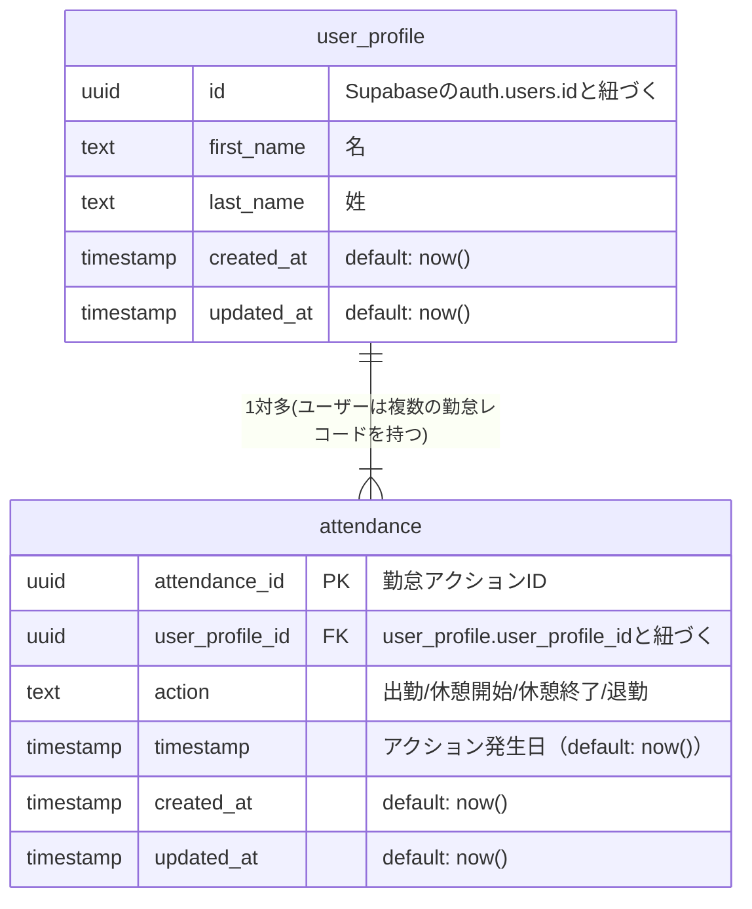

## ドキュメント
1. 認証は、Supabaseの標準の認証機能（auth.users）と連携し、自前でユーザーテーブルも作成して、プロフィール情報を管理する。
2. テーブルはuserテーブルとattendanceテーブルのみで定義する。
3. 勤務状態は前回のアクションに関連するとする。
- 出勤 (前回が退勤、あるいはレコードがない)
- 休憩開始 (前回が出勤)
- 休憩終了 (前回が休憩開始)
- 退勤(前回が出勤または休憩終了)

## テーブル定義


## トリガー定義

```sql
create function public.handle_new_user()
returns trigger
language plpgsql
security definer set search_path = ''
as $$
begin
  insert into public.user_profile (id, first_name, last_name)
  values (new.id, new.raw_user_meta_data ->> 'first_name', new.raw_user_meta_data ->> 'last_name');
  return new;
end;
$$;

create trigger on_auth_user_created
  after insert on auth.users
  for each row execute procedure public.handle_new_user();
```


## エラー内容

```txt
Error [AuthApiError]: Email not confirmed
```
